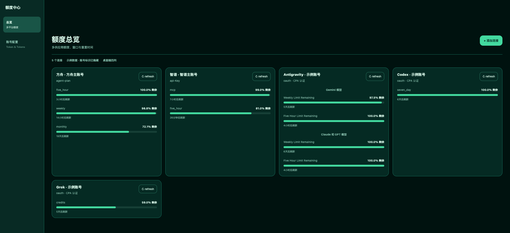

<p align="center">
  
</p>

# 额度中心

<p align="center">
  <a href="./README.md"></a>
  <a href="./README.zh-CN.md"></a>
</p>

[](https://github.com/RayenAlex/quota-center/actions/workflows/release.yml)
[](https://github.com/RayenAlex/quota-center/releases)
[](LICENSE)

一个原生 [CLIProxyAPI](https://github.com/router-for-me/CLIProxyAPI) 插件，将智谱、MiniMax、方舟、OpenCode Go、Codex、Gemini 和 Grok 的额度状态集中到同一个管理面板。

额度中心会优先复用 CPA 原生认证；手动添加的供应商凭据只写入插件自己的私有账户文件，并在面板中展示剩余窗口、重置时间和供应商错误，不会在面板或公开 resource 路由中暴露密钥。

> 额度中心只展示各上游供应商实际提供的额度数据。“暂时无法读取”表示供应商没有稳定的公开接口，并不代表账号没有可用额度。

## 界面预览



## 功能特性

- **多供应商看板** — 在同一个 CPA 面板查看额度窗口、剩余百分比和重置时间。
- **复用 CPA 原生认证** — 自动同步 CPA 中已登录的 Codex、Gemini/Antigravity 和 Grok 账号。
- **手动供应商账号** — 可从管理面板或配置文件添加智谱、MiniMax、方舟和 OpenCode Go。
- **已保存账号自动加载** — 插件重新配置后会加载已保存的手动账号并刷新额度快照。
- **清晰的管理边界** — 原生 CPA 凭据只通过 CPA 认证 API 读取，不会被本插件写入、覆盖或删除。
- **可验证发布** — 版本发布包含平台工件和独立 SHA-256 校验文件。

## 支持的供应商

| 供应商 | 认证来源 | 说明 |
| --- | --- | --- |
| 智谱 | 配置文件或管理面板中的 API Key | 使用官方额度接口。 |
| MiniMax Coding Plan | 配置文件或管理面板中的 API Key | 可选择国际站（`minimax.io`，`https://api.minimax.io/v1/api/openplatform/coding_plan/remains`）或中国站（`minimaxi.com`，`https://api.minimaxi.com/v1/token_plan/remains`）。 |
| 方舟 | AccessKey ID + Secret AccessKey | 使用签名请求查询 Agent / Coding Plan 额度。 |
| OpenCode Go | 配置文件或管理面板中的 API Key | 可以保存连接；不假设存在稳定的公开额度接口。 |
| Codex | CPA 原生认证 | 从 CPA 认证文件同步，不要重复添加手动凭据。 |
| Gemini / Antigravity | CPA 原生认证 | CPA 别名会统一映射为 Gemini 供应商。 |
| Grok | CPA 原生认证 | 使用实验性账单接口，上游失败会明确显示原因。 |

## 安装

### 手动安装

从 [GitHub Releases](https://github.com/RayenAlex/quota-center/releases) 下载对应平台的压缩包和 `.sha256` 文件，校验通过后将压缩包内的单个动态库解压到 CPA 对应平台的插件目录。

当前 tagged workflow 发布以下平台：

| 平台 | 压缩包内的动态库 |
| --- | --- |
| Linux amd64 | `quota-center.so` |
| macOS arm64 | `quota-center.dylib` |

如需其他目标平台，可以执行 `make package GOOS=<os> GOARCH=<arch>` 本地构建。

## 配置

启动 CPA 前先设置凭据环境变量。最小的智谱配置如下：

```yaml
plugins:
  configs:
    quota-center:
      enabled: true
      timeout: 15s
      accounts:
        - id: zhipu-main
          provider: zhipu
          plan: api-key
          label: 智谱主账号
          api_key_env: ZHIPU_API_KEY
```

多供应商配置可以同时使用 API Key 和 AK/SK：

```yaml
plugins:
  configs:
    quota-center:
      timeout: 15s
      accounts:
        - id: minimax-international
          provider: minimax
          plan: coding-plan
          label: MiniMax 国际站
          api_key_env: MINIMAX_CODING_KEY
          endpoint: https://api.minimax.io/v1/api/openplatform/coding_plan/remains

        - id: minimax-china
          provider: minimax
          plan: coding-plan
          label: MiniMax 中国站
          api_key_env: MINIMAX_CHINA_CODING_KEY
          endpoint: https://api.minimaxi.com/v1/token_plan/remains

        - id: ark-agent
          provider: ark
          plan: agent-plan
          label: 方舟 Agent
          access_key_env: VOLC_ACCESS_KEY
          secret_key_env: VOLC_SECRET_KEY
```

推荐使用 `accounts`。旧版 `plans` 数组仍然兼容，并会按智谱账号解析。MiniMax 账号省略 `endpoint` 时保持旧行为，默认走中国站（`minimaxi.com`）；如需国际站或明确指定中国站，请在配置中填写对应 endpoint。endpoint 覆盖必须使用 HTTPS 且匹配允许的官方主机；不支持的自定义主机会在配置阶段被拒绝。

## 使用管理面板

在 CPA 管理中心打开 **插件管理 → 额度中心 → status**。

- 在已登录 CPA 管理中心的会话中打开页面时，resource 空壳会自动加载受保护的额度面板；未认证访问仍只显示空壳。
- 使用 **添加连接** 添加智谱、MiniMax、方舟和 OpenCode Go。
- 使用 **同步 CPA 登录账号** 同步 Codex、Gemini/Antigravity 和 Grok。
- 点击账号卡片上的 **刷新** 获取最新额度窗口。
- 切换到账号视图查看遮罩后的凭据，并删除手动管理的账号。

面板不会渲染明文凭据。供应商没有稳定额度接口时，卡片仍会保留连接状态，并说明无法读取额度的原因。

## 安全边界

| 边界 | 行为 |
| --- | --- |
| 手动凭据 | 存放在 `.quota-center-accounts`，使用私有目录、`0600` 文件权限和原子替换。 |
| CPA 原生凭据 | 仅通过 `host.auth.list/get` 读取；Codex、Gemini、Grok 不会被本插件写入或删除。 |
| 面板与错误 | 凭据固定遮罩，错误信息会清理已知 API Key、Token 和 AK/SK。 |
| 公开 resource | 初始 `/v0/resource/plugins/quota-center/status` 响应不缓存且不包含账号数据；在已认证 CPA 管理会话中，浏览器会复用现有管理授权加载受保护面板。 |
| 网络请求 | 拒绝重定向，校验供应商 endpoint，并限制回调响应大小和并发数。 |

## 管理 API

所有管理路由都受 CPA Management Key 保护：

| 方法 | 路径 | 用途 |
| --- | --- | --- |
| `GET` | `/v0/management/plugins/quota-center/status` | 渲染已认证的多供应商额度面板。 |
| `POST` | `/v0/management/plugins/quota-center/accounts` | 校验并保存手动供应商账号。 |
| `DELETE` | `/v0/management/plugins/quota-center/accounts?id=<id>` | 删除手动供应商账号。 |
| `GET` | `/v0/resource/plugins/quota-center/status` | 返回不包含凭据和账号缓存数据的公开 resource。 |

## 构建、测试与发布

运行本地检查：

```bash
go test -race ./...
go vet ./...
python3 -m unittest discover -s scripts -p 'test_*.py' -v
```

构建并打包当前平台：

```bash
make package
```

构建指定平台并生成独立校验文件：

```bash
make checksums GOOS=linux GOARCH=amd64
```

发布 tag 必须与 `VERSION` 中的版本一致（`v<version>`）。GitHub Actions 会构建支持的平台矩阵、校验压缩包和 SHA-256，并拒绝覆盖已经存在的 release tag。

## 项目结构

| 路径 | 用途 |
| --- | --- |
| `*.go` | 插件 ABI、配置、账户存储、供应商客户端、管理 API 和测试。 |
| `Makefile` | 构建、打包和校验命令。 |
| `scripts/` | 压缩包生成和 Release 工件校验工具。 |
| `docs/images/` | README 图标和脱敏管理面板截图。 |
| `.github/workflows/release.yml` | 不可变的 tagged release 工作流。 |

## 许可证

[MIT](LICENSE)
